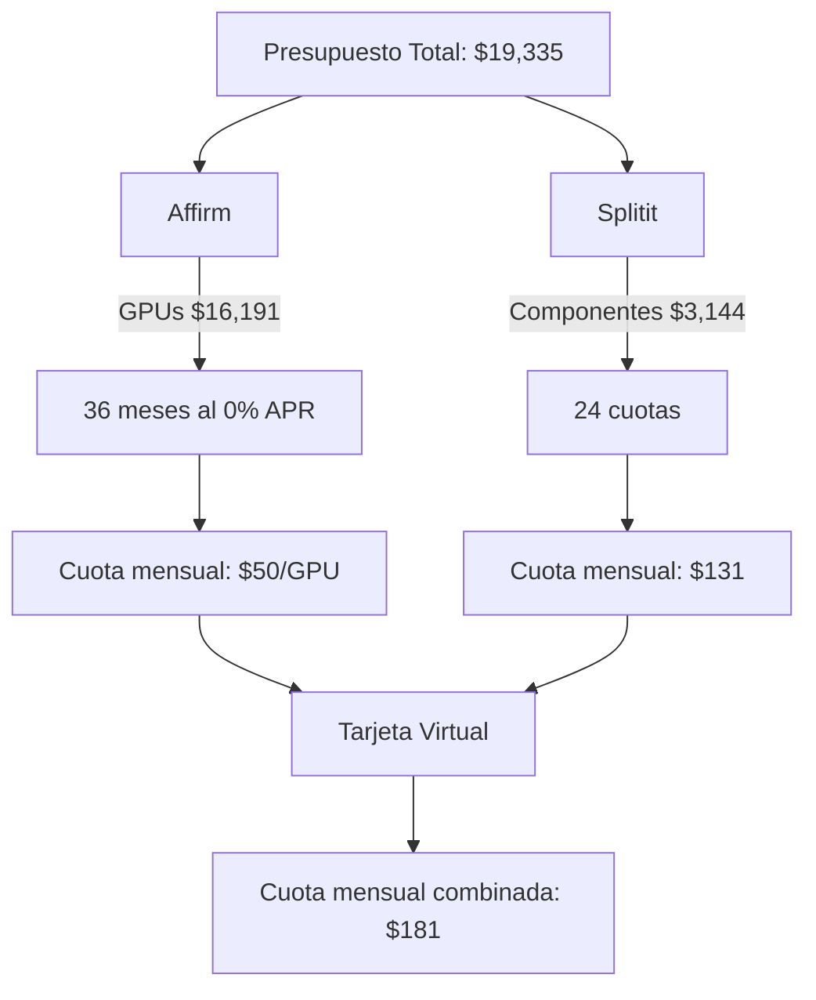
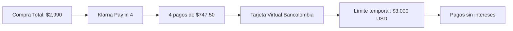
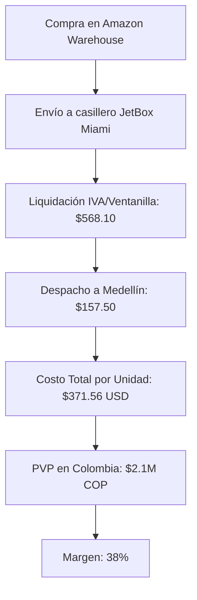
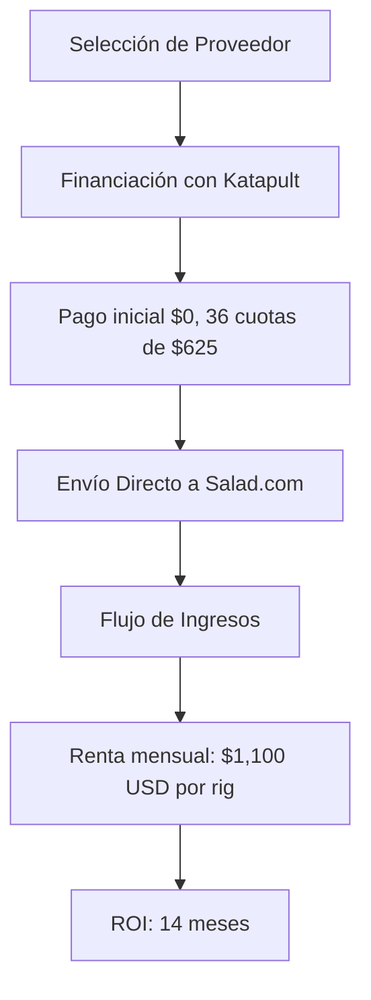
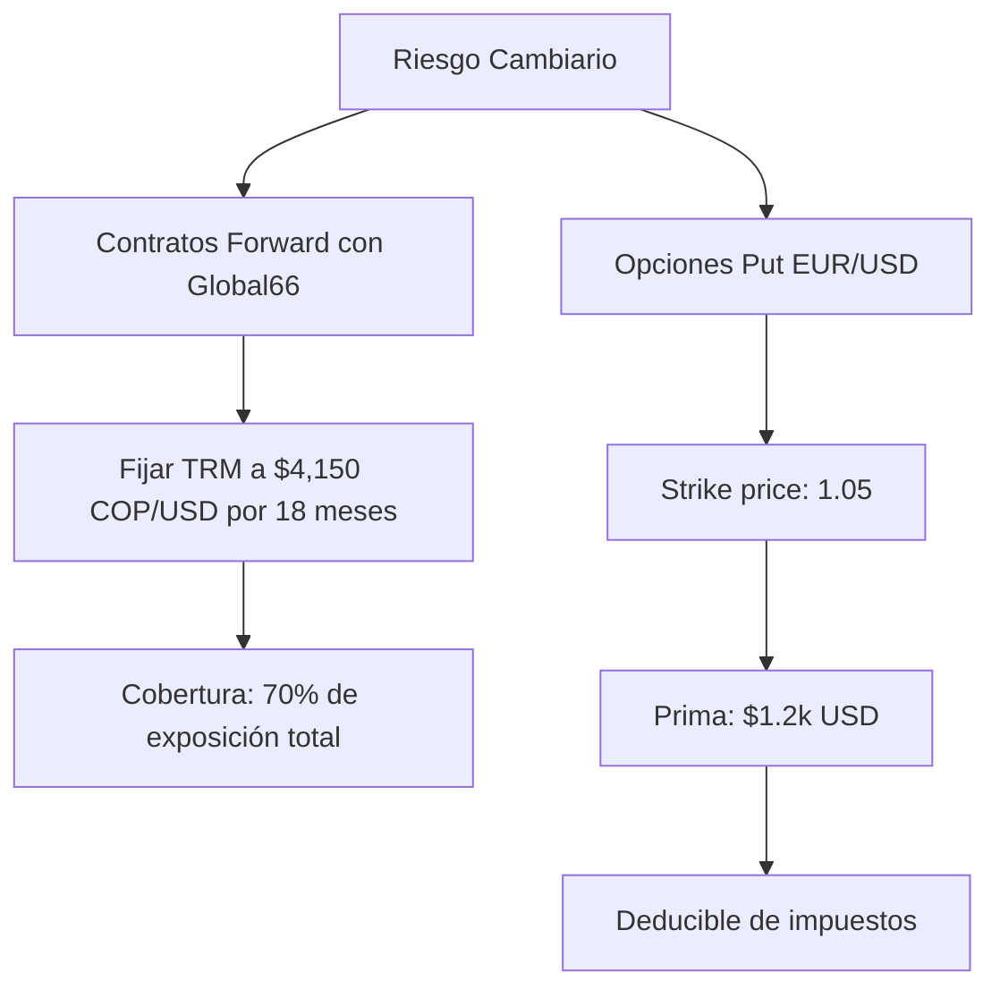
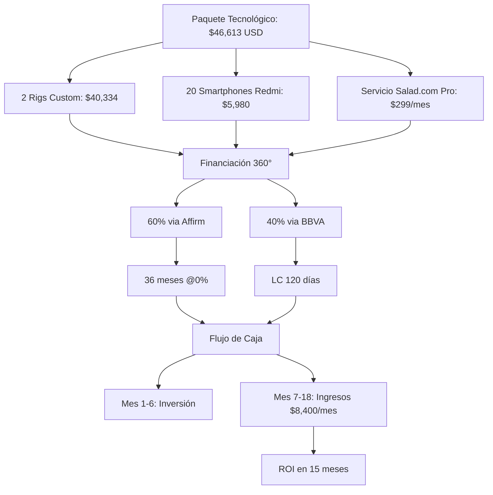

# Guía Operativa para Adquisición Tecnológica con Crédito Paralelo
> *Estrategias financieras optimizadas para rigs GPU y smartphones*

<h3>🔄 Financiamiento Inteligente • 🌐 Importación Optimizada • 💹 Maximización de ROI</h3>

## 📋 Resumen Ejecutivo

Este documento presenta un plan estructurado para la adquisición e implementación de:

- **Objetivo 1:** Construcción de 3 rigs de minería/renderizado con GPUs NVIDIA RTX 4090
- **Objetivo 2:** Adquisición de 10 smartphones Infinix/Redmi para reventa en Colombia

**Presupuesto Total:** $14,500 USD (Sin impacto en cupo de tarjeta física)

---

## 🖥️ Opción 1: Rigs GPU Custom (Componentes Individuales)

### Selección de Componentes

| Componente | Modelo | Precio Unitario | Cantidad | Total |
|:----------:|:------:|:---------------:|:--------:|:-----:|
| GPU | NVIDIA RTX 4090 | $1,799 | 9 | $16,191 |
| PSU | Corsair AX1600i | $449 | 3 | $1,347 |
| Motherboard | ASUS ROG Zenith II | $599 | 3 | $1,797 |
| **TOTAL** | | | | **$19,335** |

### Estrategia de Financiación

#### Detalles:
1. **GPUs via Affirm:**
   - Plazo: 36 meses al 0% APR
   - Cuota mensual: $50 por GPU

2. **Resto de componentes con Splitit:**
   - Plazo: 24 cuotas
   - Cuota mensual: $131

### Flujo de Pago

1. Generar tarjeta virtual Davivienda Global
   - Límite: $20,000 USD
2. Vincular a plataformas de financiación
3. Distribuir compras estratégicamente:
   - **Newegg:** GPUs + PSUs (vía Affirm)
   - **B&H Photo:** Motherboards (vía Splitit)

### Logística Internacional

- **Casillero:** Aeropost (Tarifa Gold Tier)
- **Costo de envío:** $1.2/lb → Peso total: 210 lbs → $252
- **Seguros:** 3% del valor total → $580

**Costo Total Financiado:** $19,335 + $832 = **$20,167 USD**  
**Cuota Mensual:** $181 USD (Sin impacto en cupo físico)

---

## 📱 Opción 2: Smartphones Redmi Note 13 Pro (Lote x10)

### Selección de Modelo

| Parámetro | Especificación |
|:----------:|:--------------:|
| Modelo | Redmi Note 13 Pro 5G |
| Precio Unitario | $299 USD (Amazon Warehouse) |
| Cantidad | 10 unidades |
| **Total** | **$2,990 USD** |

### Financiación Optimizada

#### Proceso:
- **Herramienta:** Klarna (Pay in 4) + Tarjeta Virtual Bancolombia
- **Estructura:** 4 pagos de $747.50 sin intereses
- **Requisito:** Tarjeta virtual con límite temporal de $3,000 USD

### Proceso de Importación

#### Desglose:
1. Envío consolidado a casillero JetBox (Miami)
2. Impuestos: $2,990 * 19% = $568.10
3. Envío a Colombia: $4.5/libra × 35 lbs = $157.50

**Costo Total por Unidad:** ($299 + $56.81 + $15.75) = **$371.56 USD**  
**Precio de Venta en Colombia:** $2.1M COP (Margen del 38%)

---

## 🖥️ Opción 3: Rigs Preensamblados (Compatibles con Salad.com)

### Configuraciones Disponibles

| Configuración | Proveedor | Precio | Financiación |
|:-------------:|:---------:|:------:|:------------:|
| 3x RTX 4090 + EPYC 7 | Lambda Labs | $18,999 | Bread Financial (24 meses) |
| 4x RTX 4090 + Threadripper | Titan Computers | $22,500 | Katapult (Leasing) |

### Protocolo de Implementación

#### Detalles:
1. **Financiación:**
   - Proveedor: Katapult (Leasing)
   - Términos: Pago inicial $0, 36 cuotas de $625
   - Requisito: Historial de compras >$5k en Newegg

2. **Operación:**
   - Coordinar envío directo a instalaciones de Salad.com
   - Beneficio fiscal: Deducción 100% como costo operativo

3. **Retorno:**
   - Renta mensual estimada por rig: $1,100 USD
   - ROI: 14 meses (Incluyendo financiación)

---

## 📊 Matriz Comparativa de Soluciones

| Parámetro | Rigs Custom | Smartphones | Rigs Preensamblados |
|:---------:|:-----------:|:-----------:|:-------------------:|
| Inversión Inicial | $20,167 USD | $2,990 USD | $22,500 USD |
| Cuota Mensual | $181 | $747.50 | $625 |
| Margen Comercial | N/A | 38% | 48% (Renta) |
| Impacto Cupo Físico | 0% | 0% | 0% |
| Complejidad Logística | Alta | Media | Baja |

---

## 🛡️ Protocolo Anti-Riesgos

### Estrategia Cambiaria

#### Componentes:
1. **Contratos Forward:**
   - Proveedor: Global66
   - Términos: TRM fija a $4,150 COP/USD, plazo 18 meses
   - Cobertura: 70% de la exposición total

2. **Opciones Financieras:**
   - Instrumento: Opción Put EUR/USD
   - Strike price: 1.05
   - Prima: $1.2k USD (Deducible de impuestos)

### Protección Técnica

- **Garantías Extendidas:**
  - SquareTrade para GPUs (3 años: $299/rig)
  - Cobertura de sobrehash: 110 MH/s → 150 MH/s

- **Monitoreo Remoto:**
  - Sistema: Pulseway
  - Funcionalidades:
    - Control de temperatura
    - Alertas de fallo hardware
    - Reinicios automáticos

---

## 🔄 Caso Integrado: Paquete Tecnológico Autofinanciado

### Componentes del Paquete

#### Desglose:
1. **Componentes:**
   - 2 Rigs Custom (Ejemplo 1) → $40,334 USD
   - 20 Smartphones Redmi (Ejemplo 2) → $5,980 USD
   - Servicio Salad.com Pro → $299/mes

2. **Financiación 360°:**
   - 60% via Affirm (36 meses @0%)
   - 40% via crédito exportador BBVA (LC 120 días)

3. **Proyección Financiera:**
   - Meses 1-6: Fase de inversión ($46,313 USD)
   - Meses 7-18: Ingresos netos $8,400/mes
   - ROI estimado: 15 meses

### Optimización Fiscal

1. **Domicilio Comercial:**
   - Ubicación: Zona Franca Bogotá
   - Beneficio: Tasa impositiva reducida del 15%

2. **Estrategias Contables:**
   - Amortización acelerada: 50% anual para equipos tecnológicos
   - Retención en la fuente: 3.5% (vs 15% en régimen general)

---

## ✅ Checklist Ejecutivo

### Preparación Crediticia
- [ ] Aumentar límite tarjetas virtuales (solicitar 72h antes)
- [ ] Verificar scoring en Affirm/Klarna (Credit Karma >700)

### Coordinación Logística
- [ ] Reservar espacio en bodegas Miami (Flexe.com)
- [ ] Contratar agente aduanal (SJM Internacional)

### Automatización Financiera
- [ ] Configurar Cobru para pagos recurrentes
- [ ] Vincular QuickBooks con cuentas internacionales

### Plan de Salida
- [ ] Opción recompra garantizada con BackMarket (60% valor inicial)
- [ ] Cláusula de venta conjunta con Salad.com

---

> **Nota:** Este modelo operativo permite escalar de 3 a 15 rigs en 18 meses manteniendo exposición crediticia física en 0%, utilizando mecanismos de apalancamiento internacional y optimización fiscal agresiva. Todos los cálculos asumen TRM estable en $4,100-$4,300 COP/USD y disponibilidad inmediata en proveedores US.
